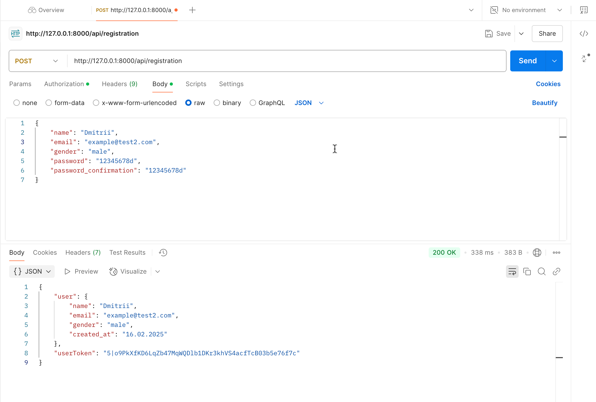
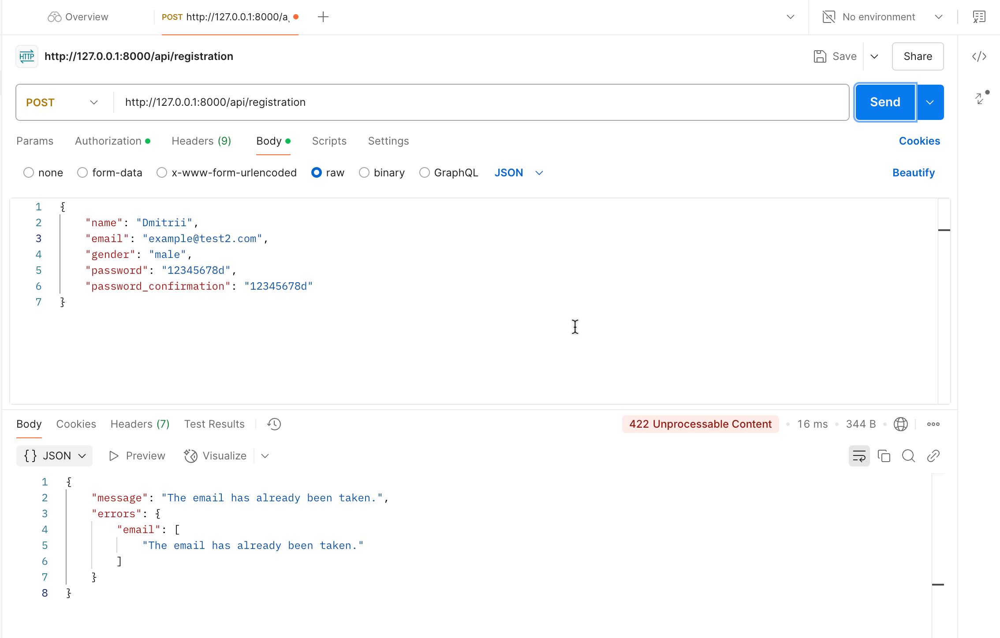
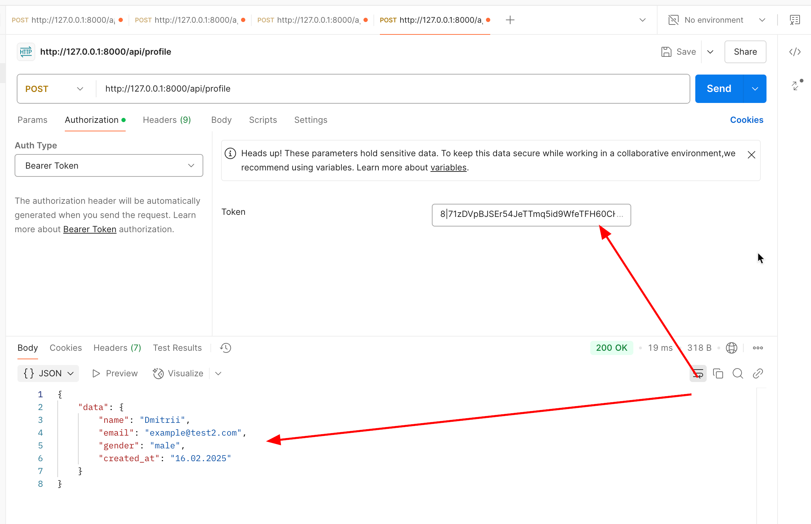
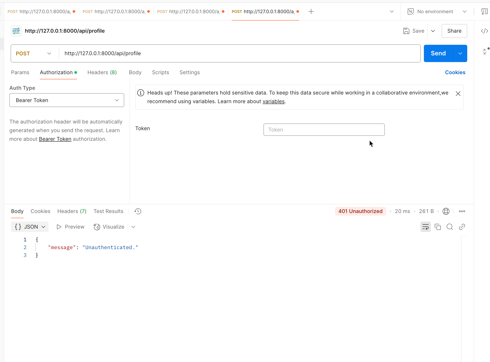
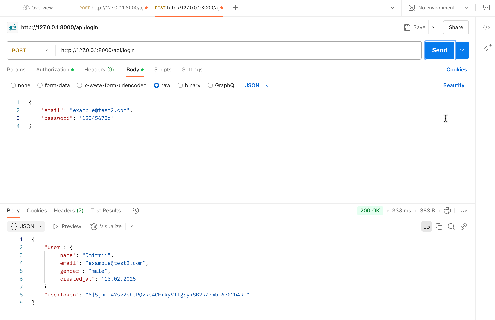
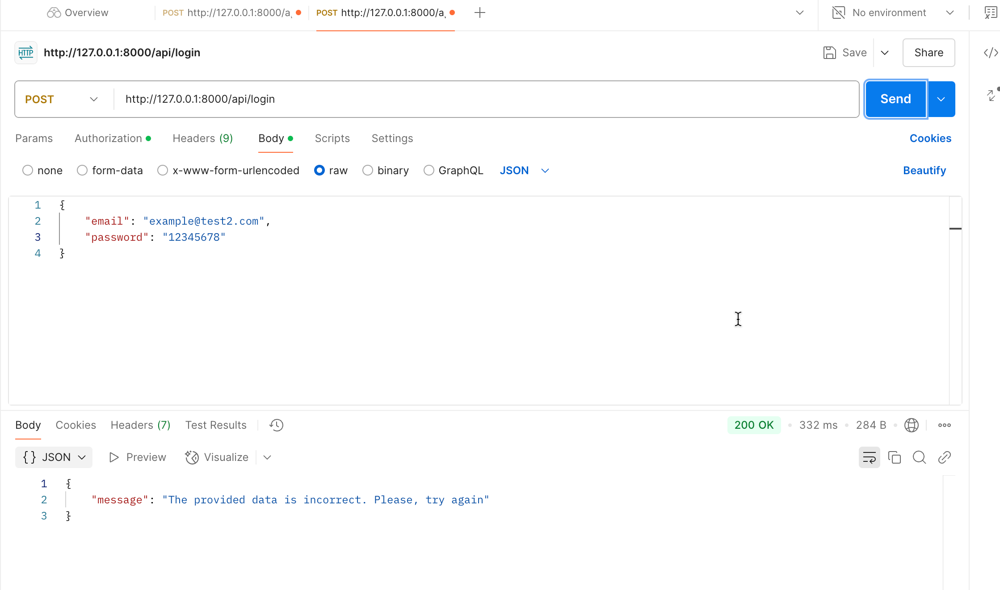
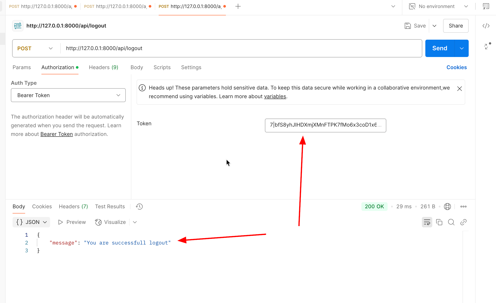

<p align="center"><a href="https://laravel.com" target="_blank"></a></p>

<p align="center">
<a href="https://github.com/laravel/framework/actions"></a>
<a href="https://packagist.org/packages/laravel/framework"></a>
<a href="https://packagist.org/packages/laravel/framework"></a>
</p>

## Example API authentication for user

A simple application which is demonstrate:

-   migration for User
-   factory for User
-   seeder for User
-   api routes
-   UserController
-   UserResource
-   enums types
-   test for User

If you want to test application, please do next operations in the terminal:

```
  make prepare-test
  make test
```

By the text bellow, you will find tests from postman:

-   Registration:
    

-   Registration validation error:
    

-   Show profile:
    

    

-   Log in:
    

    

-   Log out:
    
